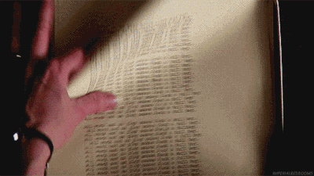

# Central Limit Theorem and Sampling

Two great tastes that taste great together

## Conceptual Writing 



#### What is the Central Limit Theorem, and how does it enable us to calculate things about statistics?


```python
'''
Your answer here
'''
```

## A spot of coding, eh


```python
#Run this cell without changes

#data manip
import pandas as pd
import numpy as np

#viz
import matplotlib.pyplot as plt

#render matplotlib in jl
%matplotlib inline

#tests
from test_background import pkl_dump, test_obj_dict, run_test_dict, run_test
```

### Import `data.csv` from the `data` folder

This is the same data you saw in the API and Pandas checkpoint yesterday


```python
# your code here
```

### Creating a distrbution of means from multiple samples

- Draw 10 random samples from the data of size 250, and for each sample, calculate the mean `hourly_rate`
    - use a list comprehension (the start of the code is provided for
    you)
    - use random_state=`trial` so that we all generate the same samples
      - (why do we assign random_state to a dynamic value?)
    

- Plot a histogram of the 25 means (does this look like any distribution you've seen?)
  - don't forget titles and labels


```python
#calculate the 10 means of `hourly_rate` from the 25 samples 
#by filling in the code below

hourly_rate_sample_means = [
    insert__code__here
    ['hourly_rate']
    insert__code__here
    for trial 
    in range(0,10)
]
```


```python
#run this cell to test!

run_test(hourly_rate_sample_means, 'hourly_rate_sample_means')
```


```python
#plot your histogram here

#no help this time!
```

## Let's do the same thing, but for 30 samples

### Under the Don't Repeat Yourself principle, let's create some functions instead of copying and pasting

#### First, a function to calculate a list of means from samples

Fill in the code below to create a function that:
- takes samples from the imported data
- where the size of the sample is a parameter
- and the number of samples is a parameter
- and `random_state` for each sample is the sample number
  - so for the first sample `random_state` is 1, for the second sample `random_state` is 2, etc.

Then, use the function to assign a list of the means of 30 samples with 250 observations in each sample to the variable `means_30`

*Hint: don't get confused by a parameter of a population and the parameter of a function!*


```python
def sample_and_mean(#your code here):
    '''
    takes samples of df and returns list of means of those samples
    
    Parameters:
        sample_size: size of samples to take (int)
        
        sample_number: number of samples to take (int)
        
    output:
        list of sample means
    '''
    
    means = [
    #your code here
    ['hourly_rate']
    #your code here
    for trial 
    #your code here
    ]
    
    return means

means_30 = #your code here
```


```python
#run this cell to test!

run_test(means_30, 'means_30')
```

#### Next, a function to plot the histograms of that list of sample means

We'll use the previous function in this histogram function!

Fill in the code below to create a function that:

- Calls sample_and_mean to generate the data to plot a histogram

- Plots the histogram of the data generated by sample_and_mean
  - Include dynamic titles based on how many samples there are and how many observations in each sample!
  
Then, call the function to create a histogram of the means of 30 samples with 250 observations each


```python
def sample_and_hist(#your code here):
    
    '''
    samples df multiple times
    
    finds the mean of `hourly_rate` for each sample
    
    creates a histogram of the results
    
    Parameters:
        sample_size: size of samples to take (int)
        
        sample_number: number of samples to take (int)  
        
    output:
        prints a histogram of means of the samples
    '''
 
    means = #your code here

    fig, ax = __insert__code__here
    
    ax.__insert__code__here
    ax.__insert__code__here
    ax.__insert__code__here
    ax.__insert__code__here
    
    plt.show()
    
sample_and_hist(#your code here)
```

### Now that we have this function let's go 


#### Generate three histograms of the means of `hourly_rate` with:
- #### 50, 500, and 5000 samples
- #### 250 observations in each sample

What do you notice?


```python
#your code here
```

#### Generate three histograms of the means of `hourly_rate` with:
- #### 500 samples each 
- #### 50, 500, and 5000 observations in each sample, respectively

What do you notice?


```python
#your code here
```
